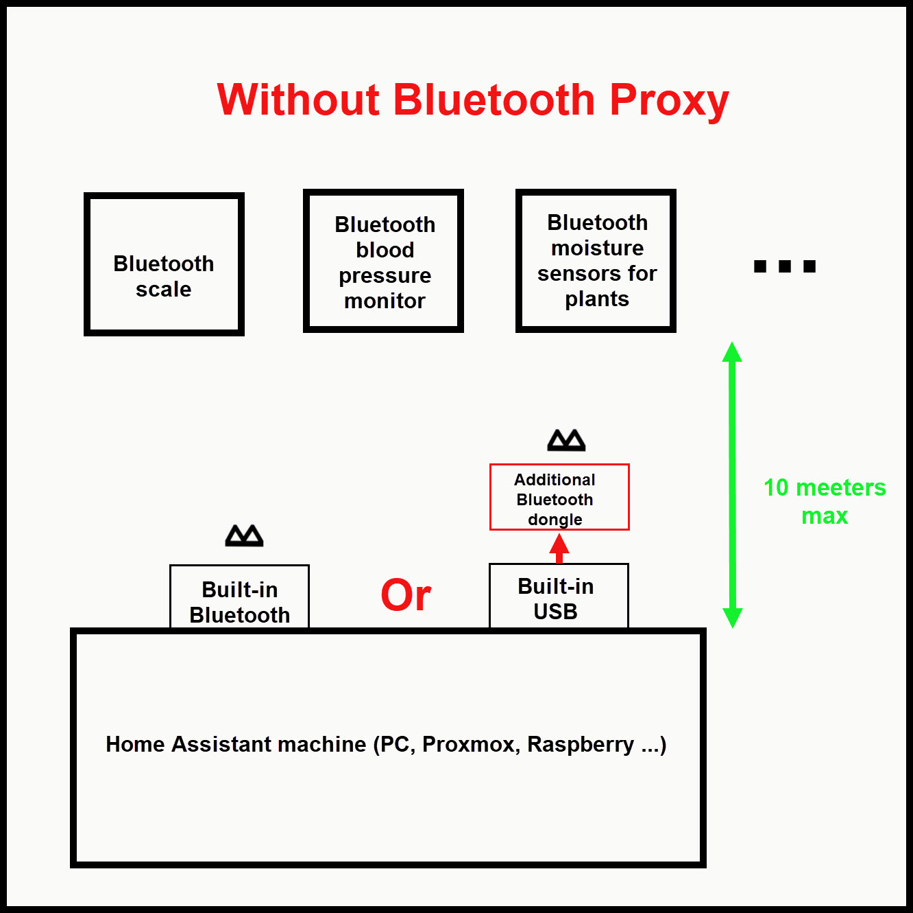
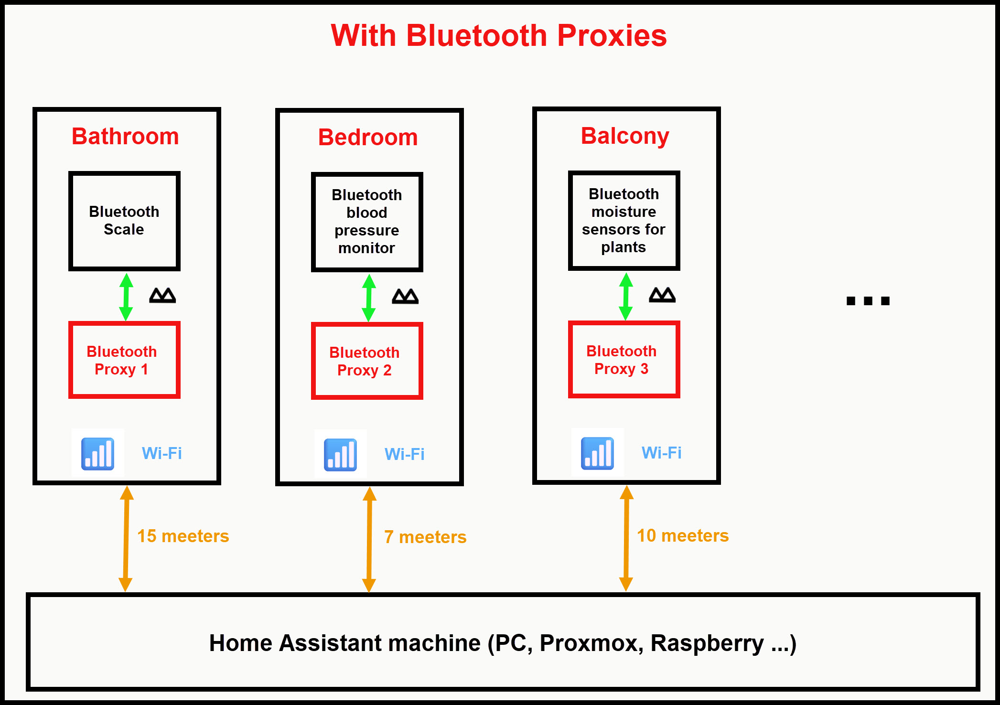

# BP-2HA Bluetooth Proxy for Home Assistant

## Why use Bluetooth with Home Assistant ?

Many household devices communicate via Bluetooth and can be integrated with **Home Assistant**, for example:

* ⚖️ a smart scale,
* 💪 a connected blood pressure monitor,
* 💧 soil moisture sensors for plants,
* 📍 Bluetooth beacons for presence detection,

and many other devices using **Bluetooth**.

The benefit of integrating them with **Home Assistant** is that you can retrieve their information and use it in your home automation system. For example, a **Bluetooth** scale can transmit your weight to Home Assistant, or a plant moisture sensor can be used to monitor the moisture level of the soil.

## How can Bluetooth be added to Home Assistant?

The simplest and most natural solution is to use the machine's built-in **Bluetooth** if available, or add a **USB Bluetooth adapter** to the machine running **Home Assistant**.

For example:

  

The **Bluetooth** dongle is then used directly by **Home Assistant** to communicate with **Bluetooth** devices, this solution works very well when the Bluetooth devices are located close to the **Home Assistant** server.

But there is one problem: **range**.

**Bluetooth** is a radio technology with a limited range. If the Home **Assistant** server is located in an office, garage, utility cupboard, or another room, Bluetooth devices located farther away may be difficult or even impossible to reach.

The range varies greatly depending on the circumstances, but it rarely exceeds 10 m.

## The solution: Bluetooth Proxy

A **Bluetooth Proxy** makes it possible to add **Bluetooth** wherever Wi-Fi is available. It is a small electronic device, usually based on an **ESP32** controller, which connects to your home's Wi-Fi network and acts as a gateway between Bluetooth devices and **Home Assistant**.

In practice, instead of having to place **Home Assistant** or a **Bluetooth** dongle close to the devices you want to control or monitor, the **Bluetooth Proxy** listens for Bluetooth communications around it and forwards the information to **Home Assistant**.

  

